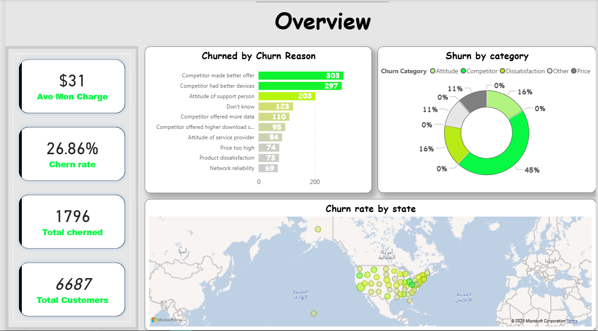
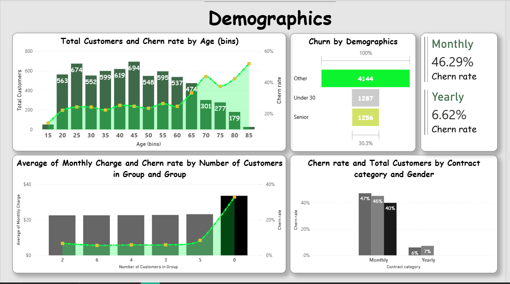

# 📊 Data Analytics & Business Intelligence Portfolio

Welcome! This repository features professional data analytics projects using **Power BI** and **Excel** to analyze sales performance and customer retention strategies.

---

## 📞 Project 1: Telecom Customer Churn Analysis
This Power BI dashboard analyzes "Databel" customer data to identify why customers are leaving and how to improve retention.

### 1️⃣ Executive Overview

  

* **Total Customers:** 6,687
* **Churn Rate:** **26.86%**
* **Top Insight:** Competitors are the primary reason for churn (~45%), specifically due to better device offers and data plans.

---

### 2️⃣ Demographics Analysis

  

* **High-Risk Segment:** **Senior Citizens** have a significantly higher churn rate of **38.46%**.
* **Group Plans:** Customers who are not part of a group plan show a higher propensity to leave the service.

---

### 3️⃣ International & Data Usage Analysis

  

* **Data Usage:** Churn is highest among customers who consume less than 5GB of monthly data.
* **International Plans:** There is a notable "plan mismatch" where customers with international plans but low usage are more likely to churn.

---

## 👟 Project 2: Adidas US Sales Dashboard (Excel)

### 🖼️ Dashboard Preview

  

* **Total Sales:** $120.1 Million
* **Total Operating Profit:** $332.1 Million
* **Top Product:** **Men's Street Footwear** leading with $82.8M in profit.
* **Top Region:** The **West Region** is the most profitable geographic area.

---

## 🛠️ Technical Skills Demonstrated
* **Data Modeling:** Established relationships between complex tables for seamless cross-filtering.
* **DAX Measures:** Developed custom calculations for churn percentages and revenue loss.
* **Advanced Excel:** Utilized Pivot Tables, Power Pivot, and Interactive Slicers.
* **ETL Process:** Cleaned and transformed raw CSV data using Power Query.

## 📂 How to Access
1.  **Clone the repo:** `git clone https://github.com/YourUsername/RepoName.git`
2.  **View Images:** Ensure the images are in the root directory for the README to display them.
3.  **Run Reports:** Open the `.pbix` file in Power BI Desktop or the `.xlsx` file in Microsoft Excel.

---
**Developed by: Muhammed** - *Data Analyst & Developer*
